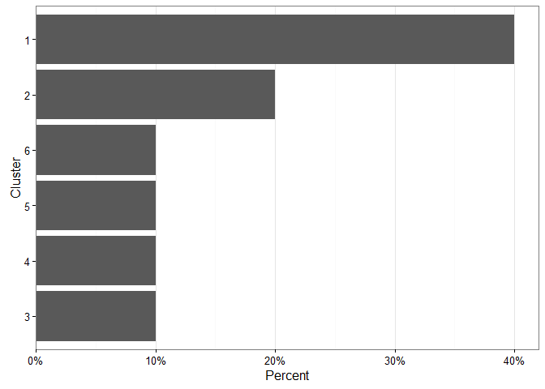
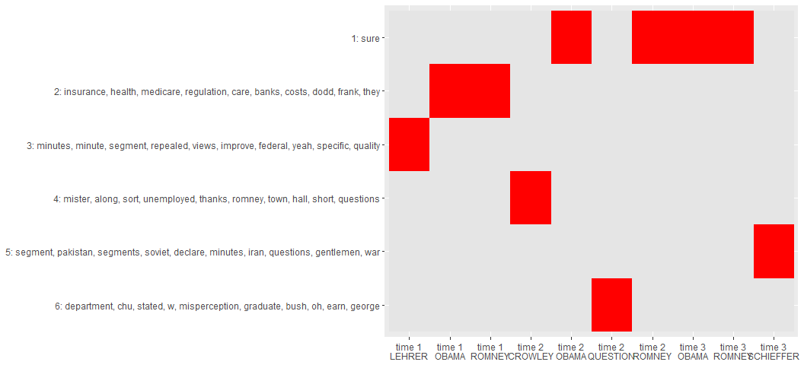
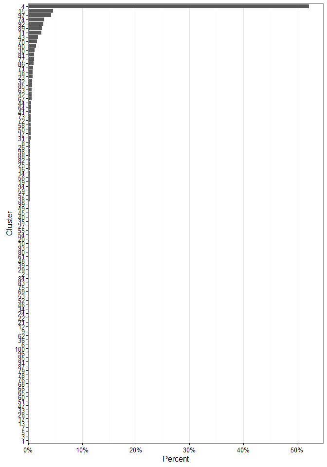

kmeanstext   
============

**Devlopment Moved to clustext Package** [**-CLICK HERE-**](https://github.com/trinker/clustext)

**kmeanstext** is a collection of optimized tools for clustering text
data via kmeans clustering. There are many great R [clustering
tools](https://cran.r-project.org/web/views/Cluster.html) to locate
topics within documents. Kmeans clustering is a popular method for topic
extraction. This package builds upon my
[hclustext](https://github.com/trinker/hclustext) package to extend the
**hclustext** package framework to kmeans. One major difference between
the two techniques is that with hierchical clustering the number of
topics is specified after thte model has been fitted, whereas kmeans
requires the k topics to be specified before the model is fit.
Additionally, kmeans uses a random start seed, the results may vary each
time a model is fit. Additionally, Euclidian distance is typically used
in a kmeans algorithm, where as any distance metric may be passed to a
hierachical clustering fit.

The general idea is that we turn the documents into a matrix of words.
After this we weight the terms by importance using
[tf-idf](http://nlp.stanford.edu/IR-book/html/htmledition/tf-idf-weighting-1.html).
This helps the more salient words to rise to the top. The user then
selects k clusters (topics) and runs the model. The model iteratively
shuffels centers and assigns documents to the clusters based on minimal
dsitance of a document to center. Each run uses the recalculated mean
centroid of the prior clusters as a starting point for the current
iteration's centroids. Once the centroids have stabalized the model has
converged at k topics. The user then may extract the clusters from the
fit, providing a grouping for documents with similar important text
features.

Table of Contents
============

-   [Functions](#functions)
-   [Installation](#installation)
-   [Contact](#contact)
-   [Demonstration](#demonstration)
    -   [Load Packages and Data](#load-packages-and-data)
    -   [Data Structure](#data-structure)
    -   [Fit the Model: kmeans Cluster](#fit-the-model-kmeans-cluster)
    -   [Assigning Clusters](#assigning-clusters)
        -   [Cluster Loading](#cluster-loading)
        -   [Cluster Text](#cluster-text)
        -   [Cluster Frequent Terms](#cluster-frequent-terms)
        -   [Clusters, Terms, and Docs Plot](#clusters-terms-and-docs-plot)
        -   [Cluster Documents](#cluster-documents)
    -   [Putting it Together](#putting-it-together)

Functions
============

The main functions, task category, & descriptions are summarized in the
table below:

<table style="width:162%;">
<colgroup>
<col width="34%" />
<col width="23%" />
<col width="104%" />
</colgroup>
<thead>
<tr class="header">
<th align="left">Function</th>
<th align="left">Category</th>
<th align="left">Description</th>
</tr>
</thead>
<tbody>
<tr class="odd">
<td align="left"><code>data_store</code></td>
<td align="left">data structure</td>
<td align="left"><strong>kmeanstext</strong>'s data structure (list of dtm + text)</td>
</tr>
<tr class="even">
<td align="left"><code>kmeans_cluster</code></td>
<td align="left">cluster fit</td>
<td align="left">Fits a kmeans cluster model</td>
</tr>
<tr class="odd">
<td align="left"><code>assign_cluster</code></td>
<td align="left">assignment</td>
<td align="left">Extract clusters for document/text element</td>
</tr>
<tr class="even">
<td align="left"><code>get_text</code></td>
<td align="left">extraction</td>
<td align="left">Get text from various <strong>kmeanstext</strong> objects</td>
</tr>
<tr class="odd">
<td align="left"><code>get_dtm</code></td>
<td align="left">extraction</td>
<td align="left">Get <code>tm::DocumentTermMatrix</code> from various <strong>kmeanstext</strong> objects</td>
</tr>
<tr class="even">
<td align="left"><code>get_removed</code></td>
<td align="left">extraction</td>
<td align="left">Get removed text elements from various <strong>kmeanstext</strong> objects</td>
</tr>
<tr class="odd">
<td align="left"><code>get_terms</code></td>
<td align="left">extraction</td>
<td align="left">Get clustered weighted important terms from an <strong>assign_cluster</strong> object</td>
</tr>
<tr class="even">
<td align="left"><code>get_documents</code></td>
<td align="left">extraction</td>
<td align="left">Get clustered documents from an <strong>assign_cluster</strong> object</td>
</tr>
</tbody>
</table>

Installation
============

To download the development version of **kmeanstext**:

Download the [zip
ball](https://github.com/trinker/kmeanstext/zipball/master) or [tar
ball](https://github.com/trinker/kmeanstext/tarball/master), decompress
and run `R CMD INSTALL` on it, or use the **pacman** package to install
the development version:

    if (!require("pacman")) install.packages("pacman")
    pacman::p_load_gh(
        "trinker/textshape", 
        "trinker/gofastr", 
        "trinker/termco",    
        "trinker/hclusttext",    
        "trinker/kmeanstext"
    )

Contact
=======

You are welcome to:    
- submit suggestions and bug-reports at: <https://github.com/trinker/kmeanstext/issues>    
- send a pull request on: <https://github.com/trinker/kmeanstext/>    
- compose a friendly e-mail to: <tyler.rinker@gmail.com>    

Demonstration
=============

Load Packages and Data
----------------------

    if (!require("pacman")) install.packages("pacman")
    pacman::p_load(kmeanstext, dplyr, textshape, ggplot2, tidyr)

    data(presidential_debates_2012)

Data Structure
--------------

The data structure for **kmeanstext** is very specific. The
`data_storage` produces a `DocumentTermMatrix` which maps to the
original text. The empty/removed documents are tracked within this data
structure, making subsequent calls to cluster the original documents and
produce weighted important terms more robust. Making the `data_storage`
object is the first step to analysis.

We can give the `DocumentTermMatrix` rownames via the `doc.names`
argument. If these names are not unique they will be combined into a
single document as seen below. Also, if you want to do stemming, minimum
character length, stopword removal or such this is when/where it's done.

    ds <- with(
        presidential_debates_2012,
        data_store(dialogue, doc.names = paste(person, time, sep = "_"))
    )

    ds

    ## Text Elements      : 10
    ## Elements Removed   : 0
    ## Documents          : 10
    ## Terms              : 3,369
    ## Non-/sparse entries: 7713/25977
    ## Sparsity           : 77%
    ## Maximal term length: 16

Fit the Model: kmeans Cluster
-----------------------------

Next we can fit a kmeans cluster model to the `data_store` object via
`kmeans_cluster`. Note that, unlike **hclustext**'s
`hierarchical_cluster`, we must provide the `k` (number of topics) to
the model.

By default `kmeans_cluster` uses an approximation of `k` based on Can &
Ozkarahan's (1990) formula (*m* \* *n*)/*t* where *m* and *n* are the
dimensions of the matrix and *t* is the length of the non-zero elements
in matrix *A*.

-   Can, F., Ozkarahan, E. A. (1990). Concepts and effectiveness of the
    cover-coefficient-based clustering methodology for text databases.
    *ACM Transactions on Database Systems 15* (4): 483.
    <doi:10.1145/99935.99938>

There are other means of determining `k` as well. See Ben Marwic's
[StackOverflow post](http://stackoverflow.com/a/15376462/1000343) for a
detailed exploration.

    set.seed(100)
    myfit <- kmeans_cluster(ds, k=6)

    str(myfit)

    ## List of 9
    ##  $ cluster     : Named int [1:10] 4 3 2 1 1 6 2 1 1 5
    ##   ..- attr(*, "names")= chr [1:10] "CROWLEY_time 2" "LEHRER_time 1" "OBAMA_time 1" "OBAMA_time 2" ...
    ##  $ centers     : num [1:6, 1:3369] 0 0 0 0 0 ...
    ##   ..- attr(*, "dimnames")=List of 2
    ##   .. ..$ : chr [1:6] "1" "2" "3" "4" ...
    ##   .. ..$ : chr [1:3369] "good" "evening" "from" "hofstra" ...
    ##  $ totss       : num 0.00897
    ##  $ withinss    : num [1:6] 0.00097 0.000458 0 0 0 ...
    ##  $ tot.withinss: num 0.00143
    ##  $ betweenss   : num 0.00754
    ##  $ size        : int [1:6] 4 2 1 1 1 1
    ##  $ iter        : int 2
    ##  $ ifault      : int 0
    ##  - attr(*, "class")= chr [1:2] "kmeans_cluster" "kmeans"
    ##  - attr(*, "text_data_store")=<environment: 0x0000000048e6d838>

Assigning Clusters
------------------

The `assign_cluster` function allows the user to extract the clusters
and the documents they are assigned to. Unlike **hclustext**'s
`assign_cluster`, the **kmeanstext** version as no `k` argument and is
merely extracting the cluster assignments from the model.

    ca <- assign_cluster(myfit)

    ca

    ##   CROWLEY_time 2    LEHRER_time 1     OBAMA_time 1     OBAMA_time 2 
    ##                4                3                2                1 
    ##     OBAMA_time 3  QUESTION_time 2    ROMNEY_time 1    ROMNEY_time 2 
    ##                1                6                2                1 
    ##    ROMNEY_time 3 SCHIEFFER_time 3 
    ##                1                5

### Cluster Loading

To check the number of documents loading on a cluster there is a
`summary` method for `assign_cluster` which provides a descending data
frame of clusters and counts. Additionally, a horizontal bar plot shows
the document loadings on each cluster.

    summary(ca)

    ##   cluster count
    ## 1       1     4
    ## 2       2     2
    ## 3       3     1
    ## 4       4     1
    ## 5       5     1
    ## 6       6     1

### Cluster Text

The user can grab the texts from the original documents grouped by
cluster using the `get_text` function. Here I demo a 40 character
substring of the document texts.

    get_text(ca) %>%
        lapply(substring, 1, 40)

    ## $`1`
    ## [1] "Jeremy, first of all, your future is bri"
    ## [2] "Well, my first job as commander in chief"
    ## [3] "Thank you, Jeremy. I appreciate your you"
    ## [4] "Thank you, Bob. And thank you for agreei"
    ## 
    ## $`2`
    ## [1] "Jim, if I if I can just respond very qui"
    ## [2] "What I support is no change for current "
    ## 
    ## $`3`
    ## [1] "We'll talk about specifically about heal"
    ## 
    ## $`4`
    ## [1] "Good evening from Hofstra University in "
    ## 
    ## $`5`
    ## [1] "Good evening from the campus of Lynn Uni"
    ## 
    ## $`6`
    ## [1] "Mister President, Governor Romney, as a "

### Cluster Frequent Terms

As with many topic clustering techniques, it is useful to get the to
salient terms from the model. The `get_terms` function uses the
`centers` from the `kmeans` output. Notice the absence of clusters 1 &
2. This is a result of lower weights (more diverse term use) across
these clusters.

    get_terms(ca, .008)

    ## $`1`
    ## NULL
    ## 
    ## $`2`
    ## NULL
    ## 
    ## $`3`
    ##       term      weight
    ## 1  minutes 0.017257547
    ## 2   minute 0.015156189
    ## 3  segment 0.009093713
    ## 4 repealed 0.009093713
    ## 5    views 0.008673442
    ## 6  improve 0.008673442
    ## 
    ## $`4`
    ##     term      weight
    ## 1 mister 0.008925013
    ## 
    ## $`5`
    ##      term     weight
    ## 1 segment 0.01446184
    ## 
    ## $`6`
    ##            term     weight
    ## 1    department 0.01709397
    ## 2           chu 0.01139598
    ## 3        stated 0.01139598
    ## 4             w 0.01139598
    ## 5 misperception 0.01139598

The `min.weight` hyperparmeter sets the lower bound on the `centers`
value to accept. If you don't get any terms you may want to lower this.
Likewise, this parameter (and lowering `nrow`) can be raised to
eliminate noise.

    get_terms(ca, .002, nrow=10) 

    ## $`1`
    ##   term      weight
    ## 1 sure 0.002350754
    ## 
    ## $`2`
    ##          term      weight
    ## 1   insurance 0.005614675
    ## 2      health 0.003503115
    ## 3    medicare 0.003142618
    ## 4  regulation 0.003033859
    ## 5        care 0.002762083
    ## 6       banks 0.002694781
    ## 7       costs 0.002114392
    ## 8        dodd 0.002007181
    ## 9       frank 0.002007181
    ## 10       they 0.002006281
    ## 
    ## $`3`
    ##        term      weight
    ## 1   minutes 0.017257547
    ## 2    minute 0.015156189
    ## 3   segment 0.009093713
    ## 4  repealed 0.009093713
    ## 5     views 0.008673442
    ## 6   improve 0.008673442
    ## 7   federal 0.007832898
    ## 8      yeah 0.006802737
    ## 9  specific 0.006062475
    ## 10  quality 0.006062475
    ## 
    ## $`4`
    ##          term      weight
    ## 1      mister 0.008925013
    ## 2       along 0.006325015
    ## 3        sort 0.005960397
    ## 4  unemployed 0.005554852
    ## 5      thanks 0.005194275
    ## 6      romney 0.004924145
    ## 7        town 0.004166139
    ## 8        hall 0.004166139
    ## 9       short 0.004166139
    ## 10  questions 0.004155420
    ## 
    ## $`5`
    ##         term      weight
    ## 1    segment 0.014461836
    ## 2   pakistan 0.007212314
    ## 3   segments 0.004597824
    ## 4     soviet 0.004597824
    ## 5    declare 0.004597824
    ## 6    minutes 0.003659317
    ## 7       iran 0.003659317
    ## 8  questions 0.003606157
    ## 9  gentlemen 0.003606157
    ## 10       war 0.003460208
    ## 
    ## $`6`
    ##             term      weight
    ## 1     department 0.017093970
    ## 2            chu 0.011395980
    ## 3         stated 0.011395980
    ## 4              w 0.011395980
    ## 5  misperception 0.011395980
    ## 6       graduate 0.007965448
    ## 7           bush 0.006861063
    ## 8             oh 0.005958716
    ## 9           earn 0.005958716
    ## 10        george 0.005958716

### Clusters, Terms, and Docs Plot

Here I plot the clusters, terms, and documents (grouping variables)
together as a combined heatmap. This can be useful for viewing &
comparing what documents are clustering together in the context of the
cluster's salient terms. This example also shows how to use the cluster
terms as a lookup key to extract probable salient terms for a given
document.

    key <- data_frame(
        cluster = 1:6,
        labs = get_terms(ca, .002) %>%
            bind_list("cluster") %>%
            select(-weight) %>%
            group_by(cluster) %>%
            slice(1:10) %>%
            na.omit() %>%
            group_by(cluster) %>%
            summarize(term=paste(term, collapse=", ")) %>%
            apply(., 1, paste, collapse=": ") 
    )

    ca %>%
        bind_vector("id", "cluster") %>%
        separate(id, c("person", "time"), sep="_") %>%
        tbl_df() %>%
        left_join(key) %>%
        mutate(n = 1) %>%
        mutate(labs = factor(labs, levels=rev(key[["labs"]]))) %>%
        unite("time_person", time, person, sep="\n") %>%
        select(-cluster) %>%
        complete(time_person, labs) %>%  
        mutate(n = factor(ifelse(is.na(n), FALSE, TRUE))) %>%
        ggplot(aes(time_person, labs, fill = n)) +
            geom_tile() +
            scale_fill_manual(values=c("grey90", "red"), guide=FALSE) +
            labs(x=NULL, y=NULL) 

    ## Joining by: "cluster"

### Cluster Documents

The `get_documents` function grabs the documents associated with a
particular cluster. This is most useful in cases where the number of
documents is small and they have been given names.

    get_documents(ca)

    ## $`1`
    ## [1] "OBAMA_time 2"  "OBAMA_time 3"  "ROMNEY_time 2" "ROMNEY_time 3"
    ## 
    ## $`2`
    ## [1] "OBAMA_time 1"  "ROMNEY_time 1"
    ## 
    ## $`3`
    ## [1] "LEHRER_time 1"
    ## 
    ## $`4`
    ## [1] "CROWLEY_time 2"
    ## 
    ## $`5`
    ## [1] "SCHIEFFER_time 3"
    ## 
    ## $`6`
    ## [1] "QUESTION_time 2"

Putting it Together
-------------------

I like working in a chain. In the setup below we work within a
**magrittr** pipeline to fit a model, select clusters, and examine the
results. In this example I do not condense the 2012 Presidential Debates
data by speaker and time, rather leaving every sentence as a separate
document. On my machine the initial `data_store` and model fit take ~35
seconds to run. Note that I do restrict the number of clusters (for
texts and terms) to a random 5 clusters for the sake of space.

    .tic <- Sys.time()

    myfit2 <- presidential_debates_2012 %>%
        with(data_store(dialogue)) %>%
        kmeans_cluster(k=100)

    difftime(Sys.time(), .tic)

    ## Time difference of 35.46239 secs

    ## View Document Loadings
    ca2 <- assign_cluster(myfit2)
    summary(ca2) %>% 
        head(12)

    ##    cluster count
    ## 1        4  1520
    ## 2       15   134
    ## 3       97   124
    ## 4       74    87
    ## 5       92    82
    ## 6       89    73
    ## 7       11    71
    ## 8       43    51
    ## 9       70    47
    ## 10      90    42
    ## 11      30    34
    ## 12      81    32

    ## Split Text into Clusters
    set.seed(3); inds <- sort(sample.int(100, 5))

    get_text(ca2)[inds] %>%
        lapply(head, 10)

    ## $`17`
    ## [1] "Questions remain."
    ## 
    ## $`32`
    ##  [1] "That's not going to happen."                                   
    ##  [2] "Many will lose it."                                            
    ##  [3] "I will not cut our commitment to our military."                
    ##  [4] "Their questions will drive the night."                         
    ##  [5] "Will will you certainly will have lots of time here coming up."
    ##  [6] "I will never know."                                            
    ##  [7] "I will not let that happen."                                   
    ##  [8] "I know how to make that happen."                               
    ##  [9] "I know how to make that happen."                               
    ## [10] "I will."                                                       
    ## 
    ## $`38`
    ## [1] "Is there too much?"                  
    ## [2] "Our party has been focused too long."
    ## [3] "And I suspect he'll keep those too." 
    ## [4] "He said, Me too."                    
    ## [5] "He said, Me too."                    
    ## [6] "He said, Me too."                    
    ## [7] "It's too high."                      
    ## 
    ## $`58`
    ##  [1] "Can we can we stay on Medicare?"                                                                       
    ##  [2] "Let's get back to Medicare."                                                                           
    ##  [3] "Let's get back to Medicare."                                                                           
    ##  [4] "of you on Medicare?"                                                                                   
    ##  [5] "We didn't cut Medicare."                                                                               
    ##  [6] "Of course, we don't have Medicare, but we didn't cut Medicare by dollar seven hundred sixteen billion."
    ##  [7] "You'll see chronic unemployment."                                                                      
    ##  [8] "You'll have four million people who will lose Medicare Advantage."                                     
    ##  [9] "You'll have hospital and providers that'll no longer accept Medicare patients."                        
    ## [10] "I'll restore that dollar seven hundred sixteen billion to Medicare."                                   
    ## 
    ## $`80`
    ## [1] "Candy, Candy|" "Candy?"        "Candy?"        "Candy, I'm|"

    ## Get Associated Terms
    get_terms(ca2, term.cutoff = .07)[inds]

    ## $`17`
    ##        term   weight
    ## 1    remain 4.753402
    ## 2 questions 4.253402
    ## 
    ## $`32`
    ##     term    weight
    ## 1 happen 0.6435874
    ## 2   will 0.5188045
    ## 3    not 0.3571543
    ## 4      i 0.1601698
    ## 5   that 0.1290930
    ## 6   know 0.1279324
    ## 7   help 0.1268966
    ## 8  needs 0.1035649
    ## 
    ## $`38`
    ##       term    weight
    ## 1      too 1.6618079
    ## 2       me 0.5322476
    ## 3       he 0.5077092
    ## 4     said 0.4417606
    ## 5     high 0.3772305
    ## 6     much 0.2277686
    ## 7  suspect 0.2144246
    ## 8     it's 0.2104448
    ## 9    he'll 0.2024865
    ## 10 focused 0.1874464
    ## 11   party 0.1820784
    ## 12   there 0.1625931
    ## 13    long 0.1346921
    ## 14    keep 0.1285173
    ## 15   those 0.1010656
    ## 
    ## $`58`
    ##            term    weight
    ## 1      medicare 0.8723376
    ## 2         sales 0.2918557
    ## 3        you'll 0.2910676
    ## 4          lose 0.2860665
    ## 5       chronic 0.2397251
    ## 6        didn't 0.2151903
    ## 7         let's 0.1944793
    ## 8            we 0.1944361
    ## 9          back 0.1792507
    ## 10          cut 0.1564845
    ## 11 unemployment 0.1545696
    ## 12          get 0.1340996
    ## 13          see 0.1215495
    ## 14           on 0.1178543
    ## 15      billion 0.1083292
    ## 16      turning 0.1065445
    ## 17      sixteen 0.1065093
    ## 18          can 0.1059886
    ## 
    ## $`80`
    ##    term    weight
    ## 1 candy 6.5684530
    ## 2   i'm 0.6042973
